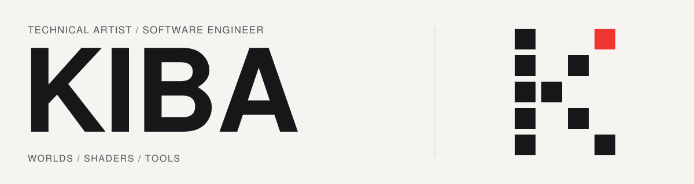

<picture>
  <source media="(prefers-color-scheme: dark)" srcset="./assets/header-dark.svg">
  
</picture>

<a href="./README.md">한국어</a> &nbsp;/&nbsp; <strong>日本語</strong>

## KIBA · 김진혁

**Technical Artist / Software Engineer**

Unity・VRChatを中心に、ワールド、シェーダー、開発ツールを制作しています。  
リアルタイムグラフィックスから映像を使った通信、ビルド・公開の自動化まで、仮想空間とその中で動く仕組みを設計しています。

  <a href="https://github.com/kibalab?tab=repositories"><b>Repositories</b></a> &nbsp;·&nbsp;
  <a href="https://x.com/kjh030529"><b>X</b></a>

## Focus

| 分野 | 取り組み |
| :--- | :--- |
| **Worlds** | VRChatワールド、インタラクション、公演・配信用コンテンツ |
| **Graphics** | リアルタイムシェーダー、マテリアル、ライティング |
| **Tools** | Unityエディター拡張、通信システム、制作・公開の自動化 |

`Unity` `C#` `UdonSharp` `HLSL` `TypeScript`

## Selected projects

| プロジェクト | 概要 |
| --- | --- |
| **[TSMP Core](https://github.com/kibalab/TSMP-Core)** | ランタイムデータをテクスチャ映像に変換し、外部配信経路を通じてVRChatのマルチインスタンス通信を構築するネットワークフレームワーク。 |
| **[VRCLI](https://github.com/kibalab/VRCLI)** | ターミナルやCIからVRChatワールド・アバターの検証、ビルド、アップロードを自動化するCLI。 |
| **[KIBAMaterialGUI](https://github.com/kibalab/KIBA-MaterialGUI)** | ShaderLab Attributeでグループ、検索、条件付き表示を構成するUnityマテリアルインスペクター拡張。 |

**More tools** · [UdonStatic](https://github.com/kibalab/UdonStatic) — シーン全体の共有値を扱う実験的UdonSharp拡張。  
[すべての公開プロジェクトを見る →](https://github.com/kibalab?tab=repositories)

## Work archive

ワールド制作、技術サポート、シェーダー開発、コンテンツの共同制作に携わってきた記録です。  
*ステータスは以前のREADMEに記載されていた時点のものです。*

<strong>依頼・共同制作プロジェクト · 19</strong>

| プロジェクト | 内容 | 当時のステータス |
| --- | --- | --- |
| YouTuber GreatMoonAroma | 配信用バーチャルプログラム、プレゼント開封コンテンツ（2件）などのVRChatワールド | 完了 |
| VRChat Japan Shrine | 各国のローカル時間を反映した昼夜変化システム | 完了 |
| WCS 2021 VR | [Tamakoshi](https://www.tamakoshi.com/)とのコラボによるVRパチンコ体験コンテンツワールド | 完了 |
| はみにの立体箱 | [はみにの立体箱](https://hamini.booth.pm/)のアバター用特殊シェーダー制作 | 完了 |
| Kyubi クローゼット | VRChat用アバターの開発・メンテナンス（Koyuki、Kokoa、Maya） | 完了・進行中 |
| Kinagai Shop | VRChat [Virtual Market Winter](https://www.youtube.com/channel/UC44QE3DVUuDrhUC5yp4zRYQ)のイベント用ブース | 完了 |
| NIJISANJI_KR | [VTuber Iroha](https://www.youtube.com/channel/UCClwIqTUn5LDpFucHyaAhHg)のコンテンツ用ワールド | 一時中断 |
| ハリノフVR | VRChatイベントワールド制作 | 完了 |
| 龍飛御天歌VR | VRChat龍飛御天歌イベントワールド制作 | 完了 |
| CLUB COLOR VR | VRChat CLUBCOLORイベントワールド制作 | 完了 |
| Aiobahn | [作曲家Aiobahn](https://librewiki.net/wiki/Aiobahn)のVRChat用アバター | 完了 |
| 配信者の年末パーティー | [YouTuber AngryBoy](https://www.youtube.com/channel/UCT7AWhMjf_5RUEHsFC6Vyrg)主催のYouTuber・ストリーマー年末パーティー用ワールドの制作・運営 | 完了 |
| PlanB Design | [PlanB Design](https://www.planb.ac/book)のメタバース書店制作プロジェクト | 完了 |
| PlanB Design | [PlanB Design](https://www.planb.ac/book)の追加メタバースプロジェクト | 準備中 |
| PlanB Design | [PlanB Design](https://www.planb.ac/book)での講演「VRChatで知るメタバースコンテンツの紹介」 | 完了 |
| YouTuber Radiyu | [YouTuber Radiyu](https://www.youtube.com/channel/UC44QE3DVUuDrhUC5yp4zRYQ)のWorld of Tanks広告コンテンツ用映画館ワールド制作 | 完了 |
| J Major・声優 Seo Yu Lee | [YouTuber ロナローナちゃん](https://www.youtube.com/channel/UCcMiI7JHjS2ONfV2PBuUabQ)の撮影用3Dコンテンツ制作 | 中断 |
| YouTuber CharmingJo | [YouTuber CharmingJo](https://www.youtube.com/c/CharmingJo%EC%A1%B0%EB%A7%A4%EB%A0%A5)の撮影用ワールド制作 | 準備中 |
| YouTuber GreatMoonAroma × HololiveID | [GreatMoonAromaとHololiveIDによる4人コラボ](https://twitter.com/aroma_great/status/1707368235438678099)の韓国語レッスン用ワールド制作 | 完了 |

<strong>チームプロジェクト · 7</strong>

| プロジェクト | 内容 | 担当 |
| --- | --- | --- |
| IY MMD WORLD | VRChatアバターでMMDを再生するシステム・ワールド | 技術サポート |
| IMO STREAM | 画像ファイルのURLを受け取り、MP4を返すTypeScriptベースのWebサービス | メインシステム開発 |
| Udon Prism | 要求されたデータのビットを映像にエンコード・暗号化して返すTypeScriptベースの通信サーバーとUdonSharpプログラム | システム設計、Udonシステム開発 |
| K13A_Mahjong | UdonSharp（C#）で開発したVR麻雀ゲームワールド | メインシステム開発、デザイン |
| CHAMCHI CONSOLE, K13A_UdonConsole | VRChatワールド開発の効率化に向け、他のユーザーのログも確認できるゲーム内コンソール | メインシステム設計、デザイン |
| Village_Hall | 田舎の高齢者向け集会所を再現した写実的な3Dマップ | システム開発、ライティング |
| KIBAEMON, KIBATION | Discordチャットボットサービス | メインシステム開発 |

<strong>個人プロジェクト · 1</strong>

| プロジェクト | 内容 |
| --- | --- |
| ANJ | アニソンVJ向けのシンプルなメディアレンダリングプログラム |

---

  <a href="https://k13b.booth.pm/">BOOTH</a>
  &nbsp; · &nbsp;
  <a href="https://steamcommunity.com/id/kjh030529/">Steam</a>
  &nbsp; · &nbsp;
  <a href="https://discord.com/users/231776579951263746">Discord</a>

